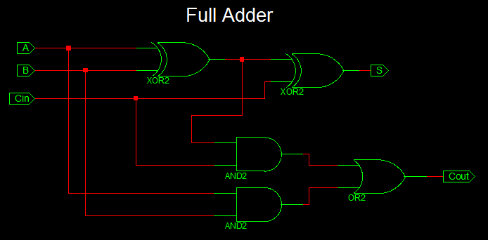

# Full Adder in VHDL

This repository contains the implementation of a 1-bit full adder in VHDL, a fundamental building block in digital electronics used to perform binary addition. The full adder adds two input binary digits and an input carry, generating a sum and a carry-out.

## Description
A full adder is essential in creating larger adders and arithmetic circuits in CPUs and ALUs. In this project:

The adder takes two 1-bit inputs (InPutNumberOne, InPutNumberTwo) and a carry input (InPutCarry).
It produces a sum output (OutPutSum) and a carry-out output (OutPutCarry).

The logic behind the full adder:

The sum is computed using the XOR operation on the inputs and the carry.
The carry-out is computed using a combination of AND and OR operations.

## Entity and Architecture
Entity

The entity defines the input and output ports:
```vhdl
entity full_adder is
    Port (
        InPutNumberOne, InPutNumberTwo, InPutCarry : in STD_LOGIC;
        OutPutSum, OutPutCarry : out STD_LOGIC
    );
end entity full_adder;
```
## Architecture
The architecture describes the behavior of the full adder:
```vhdl
architecture Functional of full_adder is
begin
    process(InPutNumberOne, InPutNumberTwo, InPutCarry)
    begin
        OutPutSum <= InPutNumberOne XOR InPutNumberTwo XOR InPutCarry;
        OutPutCarry <= (InPutNumberOne AND InPutNumberTwo) OR 
                       (InPutCarry AND (InPutNumberOne XOR InPutNumberTwo));
    end process;
end Functional;
```

## File Structure
```
/FullAdderCircuit
│
├── vhd
│   └── FullAdderCircuit.vhd        # Main VHDL file containing the full adder code
├── FullAdderCircuit.vhdpproj        # Project file for the VHDL compiler or IDE
├── _ls.toml                        # Configuration file
└── Full-Adder-VHDL-Code.png        # Image of the full adder VHDL Logic Circuit
```
## Full Adder VHDL Code Image



## Truth Table for 1-bit Full Adder

| InPutNumberOne (A) | InPutNumberTwo (B) | InPutCarry (Cin) | OutPutSum (S) | OutPutCarry (Cout) |
|--------------------|--------------------|------------------|---------------|--------------------|
| 0                  | 0                  | 0                | 0             | 0                  |
| 0                  | 0                  | 1                | 1             | 0                  |
| 0                  | 1                  | 0                | 1             | 0                  |
| 0                  | 1                  | 1                | 0             | 1                  |
| 1                  | 0                  | 0                | 1             | 0                  |
| 1                  | 0                  | 1                | 0             | 1                  |
| 1                  | 1                  | 0                | 0             | 1                  |
| 1                  | 1                  | 1                | 1             | 1                  |

## How to Compile and Simulate

To compile and simulate the VHDL code, you can use the **VHDPlus IDE**. Follow these steps to get started:

1. Install the VHDPlus IDE by following the instructions at the official documentation:  
   [VHDPlus IDE Installation Guide](https://vhdplus.com/docs/getstarted/#install-vhdplus-ide)
   
2. After installing the software, open the project file (`FullAdderCircuit.vhdpproj`) in the VHDPlus IDE.

3. Compile the project by using the compile button or the appropriate option within the IDE.

4. You can also simulate the circuit within the VHDPlus environment to observe the outputs for various inputs.
## License

MIT License

Copyright (c) 2024

Permission is hereby granted, free of charge, to any person obtaining a copy
of this software and associated documentation files (the "Software"), to deal
in the Software without restriction, including without limitation the rights
to use, copy, modify, merge, publish, distribute, sublicense, and/or sell
copies of the Software, and to permit persons to whom the Software is
furnished to do so, subject to the following conditions:

The above copyright notice and this permission notice shall be included in all
copies or substantial portions of the Software.

THE SOFTWARE IS PROVIDED "AS IS", WITHOUT WARRANTY OF ANY KIND, EXPRESS OR
IMPLIED, INCLUDING BUT NOT LIMITED TO THE WARRANTIES OF MERCHANTABILITY,
FITNESS FOR A PARTICULAR PURPOSE AND NONINFRINGEMENT. IN NO EVENT SHALL THE
AUTHORS OR COPYRIGHT HOLDERS BE LIABLE FOR ANY CLAIM, DAMAGES OR OTHER
LIABILITY, WHETHER IN AN ACTION OF CONTRACT, TORT OR OTHERWISE, ARISING FROM,
OUT OF OR IN CONNECTION WITH THE SOFTWARE OR THE USE OR OTHER DEALINGS IN THE
SOFTWARE.
[MIT LINK](https://choosealicense.com/licenses/mit/)
